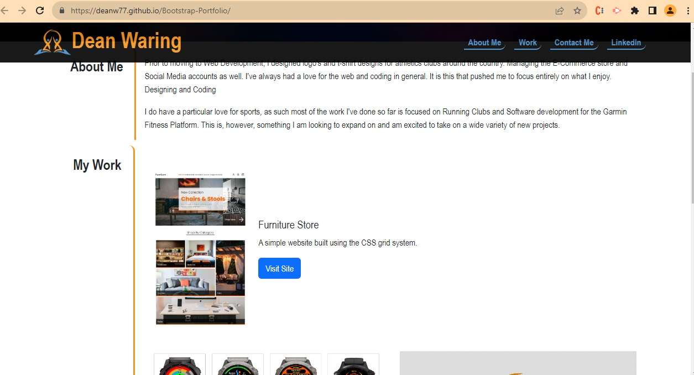

# Bootstrap-Portfolio

Portfolio Site Rebuilt Using Bootstrap 

## User Requirements

1) Rebuild portfolio using Bootstrap  
2) Include Bootstrap Navigation
3) Include a Jumbotron
4) Use Bootstrap Cards

## Problem Solved

1) Added a line of CSS to ensure that when you click to About me or Work it scrolls so the sections stay below the header.
2) LinkedIn hover affect changes size and adds border.
3) Added an anmation to show a 3D render.

## Hosted Site

View site here.....  
https://deanw77.github.io/Bootstrap-Portfolio/

### Project Overview

Despite having an absolute nightmare during this assignment, having some personal stuff that prevented me from submittin on time. 
I initially excepted that I'd have to skip this one but that red 'missing' label on the Grades page just taunts me every time I see it. So better late than never.  
My overview of Bootstrap is that I can imagine it is a great skill to have, I'll certainly be practicing further, but my personal preference would have to stay with having much cleaner HTML without all the classes. 

### Final Result

